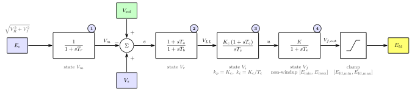

# Adding a New Model: the `SEXS_GE` Exciter

This guide walks through everything needed to add a **new dynamic model** to
`PowerSimulationsDynamics.jl` (PSID), using the GE Simplified Excitation System
(`SEXS_GE`) as a worked example. `SEXS_GE` is a good teaching case because it is a small
model that nonetheless exercises every moving part of a PSID component: a multi-state block
diagram, the mass-matrix formulation, the ODE right-hand side, and a non-trivial
initialization.

The full, runnable code for this guide lives next to this page in
[`sexs_ge_tutorial/`](https://github.com/Sienna-Platform/PowerSimulationsDynamics.jl/tree/main/docs/src/code_base_developer_guide/sexs_ge_tutorial):

  - `SEXSGE.jl` — the component struct,
  - `sexs_ge_tutorial.jl` — the three dynamics methods plus a build/swap/run demo.

!!! note "Script vs. source"
    
    To keep everything in one place, this guide implements the model **from a script**: the
    struct and the three methods are defined at top level and extend PSID/PowerSystems
    functions directly. This is perfect for prototyping and for following along, but it is
    **not** how a model is contributed to the packages. Throughout, "Where this goes in the
    package" boxes point at the canonical home for each piece. The script approach also has
    to reach into non-exported PSID internals (`PSID.Vf_var`, `PSID.lead_lag_mass_matrix`,
    …); inside the package those names are already in scope.

## The model

`SEXS_GE` extends the standard [`SEXS`](https://sienna-platform.github.io/PowerSystems.jl/stable/)
model with a voltage transducer, a PI regulator block, and a separate field-voltage limit.

```@raw html

```

The four numbered blocks are the four differential states of the model
(``V_m``, ``V_r``, ``V_i``, ``V_f``); their numbers match the `Block N` comments in
the ODE right-hand side ([Step 3](#Step-3-%E2%80%94-The-ODE-right-hand-side)). The terminal
voltage magnitude ``E_c = \sqrt{V_R^2 + V_I^2}`` enters the transducer, the summing
junction forms ``e = V_{ref} - V_m + V_s``, and the trailing limiter is the output clamp
on the field voltage that produces ``E_{fd}``.

**Parameters:** `Ta_Tb, Tb, K, Te, Tr, Kc, Tc`, regulator limits `V_lim = (Emin, Emax)`,
field-voltage limits `Efd_lim = (Efd_min, Efd_max)`, and `V_ref`. The lead-lag numerator time
constant is `Ta = Ta_Tb · Tb`.

**States (4, all differential):**

| State | Block                                | Mass-matrix diagonal |
|:----- |:------------------------------------ |:-------------------- |
| `Vm`  | transducer ``1/(1+sT_r)``            | `Tr`                 |
| `Vr`  | lead-lag ``(1+sT_a)/(1+sT_b)``       | `Tb`                 |
| `Vi`  | PI integrator ``K_c(1+sT_c)/(sT_c)`` | **none (default 1)** |
| `Vf`  | forward lag ``K/(1+sT_e)``           | `Te`                 |

!!! tip "The PI block"
    
    ``K_c(1+sT_c)/(sT_c) = K_c + K_c/(sT_c)`` is a PI controller with proportional gain
    ``k_p = K_c`` and integral gain ``k_i = K_c/T_c``. It is realized with
    `pi_block`, so ``dV_i/dt = V_{LL}`` and the block output is ``K_c V_{LL} + (K_c/T_c)V_i``.
    Because `Tc` lives in the gain `ki`, the integrator state `Vi` gets **no** mass-matrix
    entry.

## Step 1 — The component struct

A dynamic component is a `PowerSystems` struct. New models subtype the appropriate abstract
type — here `PSY.AVR`. The struct carries its parameters plus four bookkeeping fields
(`states`, `n_states`, `states_types`, `internal`) that PSID uses to wire the model into the
system's state vector.

```julia
mutable struct SEXSGE <: PSY.AVR
    Ta_Tb::Float64
    Tb::Float64
    K::Float64
    Te::Float64
    Tr::Float64
    Kc::Float64
    Tc::Float64
    V_lim::PSY.MinMax       # (Emin, Emax)
    Efd_lim::PSY.MinMax     # (Efd_min, Efd_max)
    V_ref::Float64
    ext::Dict{String, Any}
    states::Vector{Symbol}
    n_states::Int
    states_types::Vector{PSY.StateTypes}
    internal::PSY.InfrastructureSystemsInternal
end
```

A keyword constructor fills the bookkeeping fields with the state list and types:

```julia
SEXSGE(;
    Ta_Tb,
    Tb,
    K,
    Te,
    Tr,
    Kc,
    Tc,
    V_lim,
    Efd_lim,
    V_ref = 1.0,
    ext = Dict{String, Any}(),
) =
    SEXSGE(Ta_Tb, Tb, K, Te, Tr, Kc, Tc, V_lim, Efd_lim, V_ref, ext,
        [:Vm, :Vr, :Vi, :Vf], 4,
        fill(PSY.StateTypes.Differential, 4),
        PSY.InfrastructureSystemsInternal())
```

PSID's wrapper machinery reads the state list through `PSY.get_states`, `PSY.get_n_states`,
and `PSY.get_states_types`, so those getters must extend the PowerSystems functions:

```julia
PSY.get_states(value::SEXSGE) = value.states
PSY.get_n_states(value::SEXSGE) = value.n_states
PSY.get_states_types(value::SEXSGE) = value.states_types
PSY.get_internal(value::SEXSGE) = value.internal
# ... plus a getter per parameter (get_Tr, get_Kc, get_Tc, ...)
```

See `SEXSGE.jl` for the complete struct and getter list.

!!! note "Where this goes in the package"
    
    Component structs are **not hand-written** in PowerSystems. They are **generated** from a
    JSON descriptor: you add the model's parameters and states to the descriptor and run the
    code generator, which writes `src/models/generated/SEXS_GE.jl` (struct, constructors, and
    every getter/setter). Never edit a generated file by hand. We write `SEXSGE.jl` manually
    here only so the model is self-contained in a script.

## Step 2 — Mass-matrix entries

PSID writes the dynamics in semi-explicit form ``M \dot{x} = f(x)``. For a first-order block
with time constant ``T``, the entry ``T`` goes on the mass-matrix diagonal for that state.
A zero time constant becomes an algebraic equation automatically (the diagonal entry is 0).

```julia
function PSID.mass_matrix_avr_entries!(
    mass_matrix,
    avr::SEXSGE,
    global_index::Base.ImmutableDict{Symbol, Int64},
)
    mass_matrix[global_index[:Vm], global_index[:Vm]] = get_Tr(avr)
    mass_matrix[global_index[:Vr], global_index[:Vr]] = get_Tb(avr)
    mass_matrix[global_index[:Vf], global_index[:Vf]] = get_Te(avr)
    return
end
```

Note there is **no** entry for `Vi`: the PI integrator's time constant is folded into the
integral gain, so its diagonal stays at the default value of 1.

!!! note "Where this goes in the package"
    
    Add this method to
    `src/models/generator_models/avr_models.jl`, next to the other
    `mass_matrix_avr_entries!` methods.

## Step 3 — The ODE right-hand side

`mdl_avr_ode!` computes ``f(x)`` for the AVR states and publishes the field voltage to the
machine through `inner_vars`. The body is a one-to-one transcription of the block diagram,
using PSID's [common control blocks](https://github.com/Sienna-Platform/PowerSimulationsDynamics.jl/blob/main/src/models/common_controls.jl).

```julia
function PSID.mdl_avr_ode!(
    device_states::AbstractArray{<:PSID.ACCEPTED_REAL_TYPES},
    output_ode::AbstractArray{<:PSID.ACCEPTED_REAL_TYPES},
    inner_vars::AbstractArray{<:PSID.ACCEPTED_REAL_TYPES},
    dynamic_device::PSID.DynamicWrapper{PSY.DynamicGenerator{M, S, SEXSGE, TG, P}},
    h,
    t,
) where {M <: PSY.Machine, S <: PSY.Shaft, TG <: PSY.TurbineGov, P <: PSY.PSS}
    V0_ref = PSID.get_V_ref(dynamic_device)
    local_ix = PSID.get_local_state_ix(dynamic_device, SEXSGE)

    internal_states = @view device_states[local_ix]
    Vm, Vr, Vi, Vf =
        internal_states[1], internal_states[2], internal_states[3], internal_states[4]

    V_th = sqrt(inner_vars[PSID.VR_gen_var]^2 + inner_vars[PSID.VI_gen_var]^2)  # Ec
    Vs = inner_vars[PSID.V_pss_var]                                            # PSS output

    avr = PSY.get_avr(dynamic_device)
    Ta_Tb = get_Ta_Tb(avr)
    Tb = get_Tb(avr)
    Ta = Tb * Ta_Tb
    Te = get_Te(avr)
    Tr = get_Tr(avr)
    K = get_K(avr)
    Kc = get_Kc(avr)
    Tc = get_Tc(avr)
    Emin, Emax = get_V_lim(avr)
    Efd_min, Efd_max = get_Efd_lim(avr)

    # Block 1 — voltage transducer  Vm = Ec / (1 + sTr)
    _, dVm = PSID.low_pass_mass_matrix(V_th, Vm, 1.0, Tr)
    # Summing junction
    e = V0_ref - Vm + Vs
    # Block 2 — lead-lag (1 + sTa)/(1 + sTb)
    V_LL, dVr = PSID.lead_lag_mass_matrix(e, Vr, 1.0, Ta, Tb)
    # Block 3 — PI  Kc(1 + sTc)/(sTc)  ->  kp = Kc, ki = Kc/Tc
    u_pi, dVi = PSID.pi_block(V_LL, Vi, Kc, Kc / Tc)
    # Block 4 — forward lag with non-windup limits  K/(1 + sTe), [Emin, Emax]
    Vf_out, dVf = PSID.low_pass_nonwindup_mass_matrix(u_pi, Vf, K, Te, Emin, Emax)
    # Output clamp on the field voltage
    Vf_sat = clamp(Vf_out, Efd_min, Efd_max)

    output_ode[local_ix[1]] = dVm
    output_ode[local_ix[2]] = dVr
    output_ode[local_ix[3]] = dVi
    output_ode[local_ix[4]] = dVf

    inner_vars[PSID.Vf_var] = Vf_sat
    return
end
```

A few conventions worth internalizing:

  - Every control block has a `*_mass_matrix` variant that returns the **unscaled** derivative
    (the ``1/T`` is supplied by the mass matrix). Pair these with `mass_matrix_avr_entries!`.
  - States are read from a `@view` into the global `device_states` vector, in the same order
    as the `states` list.
  - The terminal voltage magnitude `Ec`, the PSS signal, and the field voltage are exchanged
    with the rest of the device through the `inner_vars` vector.

!!! note "Where this goes in the package"
    
    Add this method to
    `src/models/generator_models/avr_models.jl`, alongside the `SEXS` ODE.

## Step 4 — Initialization

Initialization places every state at its steady-state value for the power-flow operating
point, and solves for `V_ref`. For `SEXS_GE` there is a clean simplification: the integrator
forces its own input to zero at equilibrium, so ``V_{LL} = 0`` and therefore
``V_{ref} = V_m = E_c`` (the terminal voltage). The remaining states follow in closed form
(``V_r = 0``, ``V_f = V_{f0}``, ``V_i = V_{f0}\,T_c/(K\,K_c)``). We still solve with `NLsolve`
to match the style of the other AVRs in `init_avr.jl`.

```julia
function PSID.initialize_avr!(
    device_states,
    static::PSY.StaticInjection,
    dynamic_device::PSID.DynamicWrapper{PSY.DynamicGenerator{M, S, SEXSGE, TG, P}},
    inner_vars::AbstractVector,
) where {M <: PSY.Machine, S <: PSY.Shaft, TG <: PSY.TurbineGov, P <: PSY.PSS}
    Vf0 = inner_vars[PSID.Vf_var]
    Vm = sqrt(inner_vars[PSID.VR_gen_var]^2 + inner_vars[PSID.VI_gen_var]^2)

    avr = PSY.get_avr(dynamic_device)
    Ta_Tb = get_Ta_Tb(avr)
    Tb = get_Tb(avr)
    Ta = Tb * Ta_Tb
    K = get_K(avr)
    Kc = get_Kc(avr)
    Tc = get_Tc(avr)
    Emin, Emax = get_V_lim(avr)

    function f!(out, x)
        V_ref, Vr, Vi, Vf = x[1], x[2], x[3], x[4]
        e = V_ref - Vm                      # Vs = 0 at initialization
        V_LL = Vr + (Ta / Tb) * e
        u_pi = Kc * V_LL + (Kc / Tc) * Vi
        out[1] = (1.0 - Ta / Tb) * e - Vr   # lead-lag steady state
        out[2] = V_LL                       # PI integrator input must vanish
        out[3] = K * u_pi - Vf              # forward lag steady state
        out[4] = Vf - Vf0                   # field voltage matches the machine
    end
    x0 = [1.0, 0.0, Vf0 * Tc / (K * Kc), Vf0]
    sol = NLsolve.nlsolve(f!, x0; ftol = PSID.STRICT_NLSOLVE_F_TOLERANCE)
    if !NLsolve.converged(sol)
        @warn("Initialization of SEXSGE AVR in $(PSY.get_name(static)) failed")
    else
        V_ref, Vr, Vi, Vf = sol.zero[1], sol.zero[2], sol.zero[3], sol.zero[4]
        if (Vf > Emax + PSID.BOUNDS_TOLERANCE) || (Vf < Emin - PSID.BOUNDS_TOLERANCE)
            @error("Field voltage Vf = $Vf outside regulator limits [$Emin, $Emax].")
        end
        PSY.set_V_ref!(avr, V_ref)
        PSID.set_V_ref(dynamic_device, V_ref)
        avr_states = @view device_states[PSID.get_local_state_ix(dynamic_device, SEXSGE)]
        avr_states[1], avr_states[2], avr_states[3], avr_states[4] = Vm, Vr, Vi, Vf
    end
    return
end
```

!!! warning "Initialization is the usual culprit"
    
    When a new model misbehaves, initialization is the first place to look. Always verify the
    initialized states against hand-derived steady-state values before trusting a transient.
    `show_states_initial_value(sim)` prints them.

!!! note "Where this goes in the package"
    
    Add this method to
    `src/initialization/generator_components/init_avr.jl`, next to the `SEXS` initializer.

## Step 5 — Run it

We reuse the `SEXS` validation system and change **only** the exciter, so the comparison is
honest. We read the existing dynamic generator, rebuild it with a `SEXS_GE` AVR (copying the
shared `SEXS` parameters and adding the GE-specific ones), and swap it back in.

```julia
sys = PSY.System("ThreeBusMulti.raw", "ThreeBus_SEXS.dyr")
for l in PSY.get_components(PSY.StandardLoad, sys)
    PSID.transform_load_to_constant_impedance(l)
end

static = first(
    s for s in PSY.get_components(PSY.StaticInjection, sys)
    if PSY.get_dynamic_injector(s) isa PSY.DynamicGenerator
)
old_dyn = PSY.get_dynamic_injector(static)
old_avr = PSY.get_avr(old_dyn)

new_avr = SEXSGE(;
    Ta_Tb = PSY.get_Ta_Tb(old_avr), Tb = PSY.get_Tb(old_avr),
    K = PSY.get_K(old_avr), Te = PSY.get_Te(old_avr),
    Tr = 0.02, Kc = 1.0, Tc = 10.0,
    V_lim = PSY.get_V_lim(old_avr), Efd_lim = (min = -50.0, max = 50.0),
    V_ref = PSY.get_V_ref(old_avr),
)
new_dyn = PSY.DynamicGenerator(;
    name = PSY.get_name(old_dyn), ω_ref = PSY.get_ω_ref(old_dyn),
    machine = PSY.get_machine(old_dyn), shaft = PSY.get_shaft(old_dyn),
    avr = new_avr, prime_mover = PSY.get_prime_mover(old_dyn),
    pss = PSY.get_pss(old_dyn), base_power = PSY.get_base_power(old_dyn),
)
PSY.replace_dynamic_injector!(sys, static, new_dyn)   # remove old, attach new (same name)

sim = PSID.Simulation!(
    PSID.ResidualModel, sys, mktempdir(), (0.0, 20.0),
    PSID.BranchTrip(1.0, PSY.Line, "BUS 1-BUS 2-i_1"),
)
PSID.show_states_initial_value(sim)            # initialization checkpoint
@assert PSID.small_signal_analysis(sim).stable
PSID.execute!(sim, Sundials.IDA(); dtmax = 0.005, saveat = 0.005)
results = PSID.read_results(sim)
```

With the demo parameters above, the model initializes to ``V_i \approx 1.08``,
``V_f \approx 2.15`` (matching the closed-form values), is small-signal stable, and the
`IDA` run finalizes cleanly. The field voltage responds to the line trip and the terminal
voltage dips and recovers.

## Production checklist

To turn this prototype into a real contribution:

 1. **PowerSystems** — add the model to the JSON descriptor and regenerate the struct; export
    it; add a PSS/E `.dyr` parser entry if the model has a standard record.
 2. **PowerSimulationsDynamics** — move the three methods into
    `src/models/generator_models/avr_models.jl` and
    `src/initialization/generator_components/init_avr.jl`.
 3. **Tests** — add a validation case (see `test/test_case26_SEXS.jl` for the pattern):
    initialization, small-signal eigenvalues, and a transient compared against a reference.
 4. **Docs** — document the model in `docs/src/component_models/avr.md`.

!!! tip "Run the full example"
    
    The complete, runnable script is at
    [`sexs_ge_tutorial/sexs_ge_tutorial.jl`](https://github.com/Sienna-Platform/PowerSimulationsDynamics.jl/tree/main/docs/src/code_base_developer_guide/sexs_ge_tutorial).
    Run it from the test environment so PSID's solver and `NLsolve` dependencies are available:
    `julia --project=test docs/src/code_base_developer_guide/sexs_ge_tutorial/sexs_ge_tutorial.jl`.
